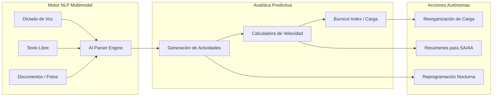
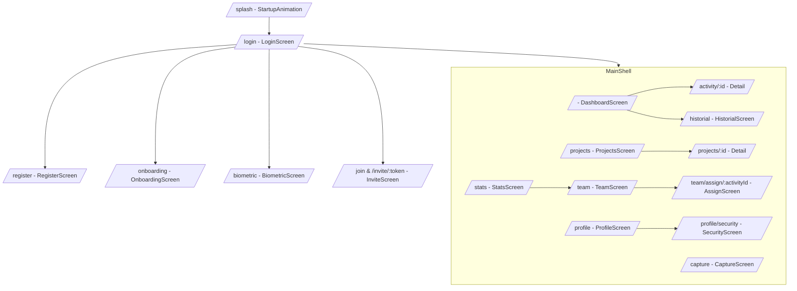
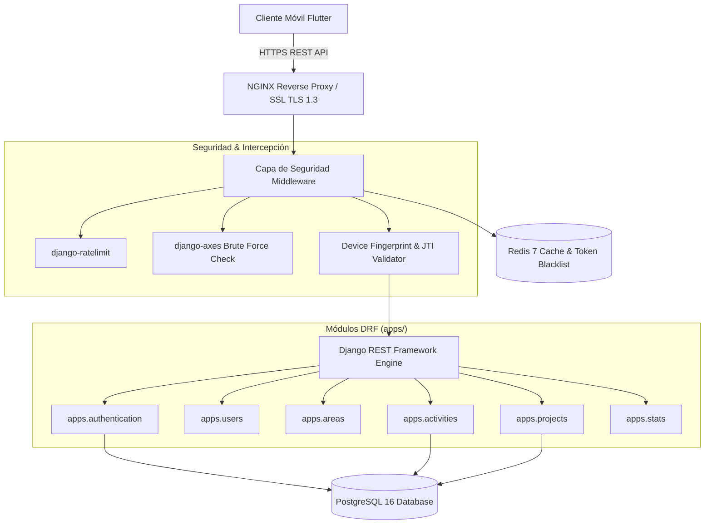
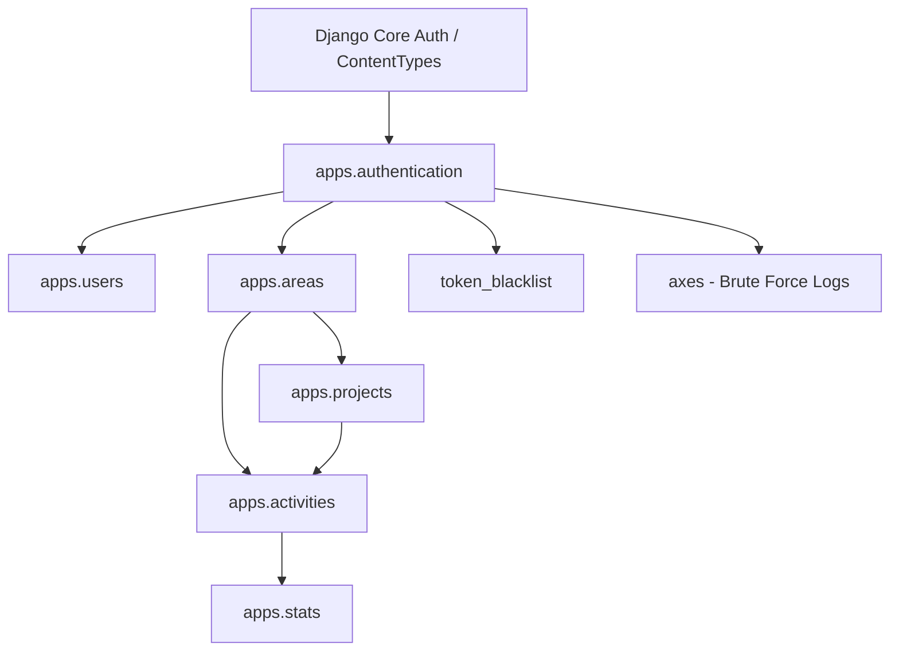
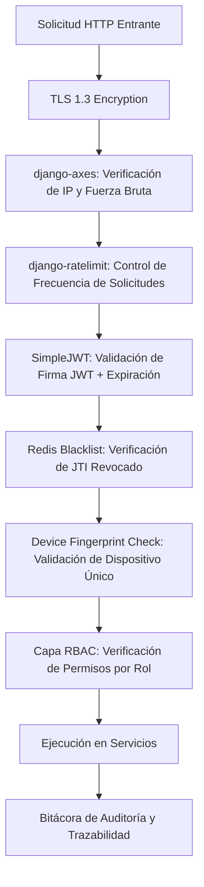

# HiperApp (Focus) — Sistema de Hiperproductividad e Integración Total de IA

[](https://flutter.dev)
[](https://dart.dev)
[](https://www.django-rest-framework.org/)
[](https://www.postgresql.org/)
[](https://redis.io/)
[](https://www.docker.com/)
[](https://www.iso.org/isoiec-27001-information-security.html)
[](#)

Plataforma de productividad corporativa e institucional orientada a mejorar la gestión del trabajo individual y colaborativo en entornos de alta exigencia operacional. Integra un cliente móvil en Flutter, capacidades offline-first, servicios backend con Django REST Framework, PostgreSQL y Redis, además de componentes de automatización e inteligencia artificial en evolución.

> **Estado del proyecto:** MVP funcional en evolución. El cliente Flutter cuenta con componentes reales de navegación, almacenamiento seguro, biometría, persistencia local y manejo de conectividad. Algunas capacidades backend, predictivas y de automatización descritas en este documento representan arquitectura objetivo o funcionalidades en validación.

---

## 1. Reconocimiento Institucional C5 Morelos 2025

Este proyecto forma parte de la experiencia técnica por la cual recibí un reconocimiento del **Centro de Coordinación, Comando, Control, Comunicaciones y Cómputo (C5) de Morelos** en 2025, relacionado con aportaciones tecnológicas e integración práctica de inteligencia artificial y automatización. El reconocimiento documenta una contribución individual y no implica certificación, validación formal del producto ni respaldo institucional de TreeTech.


---

## 2. Propuesta de Valor y Objetivos de Validación

El sistema busca reducir fricción en la captura de tareas, mejorar la visibilidad del avance de proyectos y facilitar la detección temprana de cuellos de botella mediante un enfoque de ingeniería centrado en rendimiento, trazabilidad y validación progresiva.

| Dimensión Operativa | Desafío Tradicional | Capacidad Diseñada / Implementada | Objetivo o Hipótesis por Validar |
| :--- | :--- | :--- | :--- |
| Ingesta de Tareas | Formularios manuales lentos | Captura asistida por voz y texto libre | Reducir de forma medible el tiempo de registro frente a formularios tradicionales |
| Visibilidad Ejecutiva | Informes desactualizados | Tablero interactivo con desglose RBAC por área | Mejorar la visibilidad operativa con información actualizada y filtrada por rol |
| Riesgo de Entregas | Detección tardía del retraso | Modelo de alertas y análisis de carga en evolución | Anticipar posibles retrasos con suficiente tiempo para intervención humana |
| Seguridad y Auditoría | Registros alterables o ausentes | Bitácora de eventos, control de acceso y trazabilidad inspirada en buenas prácticas de seguridad | Mantener evidencia suficiente para revisar acciones críticas y cambios de estado |
| Operatividad en Campo | Dependencia de red celular | Persistencia local con SQLite y estrategia de sincronización | Mantener continuidad de uso durante interrupciones de conectividad, sujeta a validación técnica |

---

## 3. Arquitectura de Inteligencia Artificial y Automatización

La arquitectura propuesta separa la interfaz de usuario de los componentes de captura asistida, análisis y automatización. Algunas capacidades se encuentran implementadas y otras permanecen en fase de evolución o validación.



### 3.1 Captura Inteligente y Procesamiento de Lenguaje Natural (NLP)
* **Voice-to-Action**: Ingesta de dictados de voz y notas no estructuradas procesadas en tiempo real.
* **Extracción de Entidades**:
  * Normalización sintáctica del título y la descripción.
  * Clasificación automática de estados (`inbox`, `today`, `tomorrow`, `scheduled`, `pending`).
  * Asignación de prioridad (`baja`, `media`, `alta`, `critica`).
  * Parseo sintáctico de fechas y horas límite (ej. *"entregar este viernes a las 16:00"*).
  * Auto-etiquetado y vinculación a proyectos u organizaciones.

### 3.2 Analítica de Carga y Recomendaciones Operativas
* **Evaluación de Ritmo por Área**: Diseño orientado a estimar tiempos promedio de resolución por integrante y por área.
* **Detección de Saturación**: Capacidad planteada para identificar señales de sobrecarga a partir de reglas y métricas configurables.
* **Reasignación Sugerida**: Propone alternativas de redistribución para revisión del Administrador de Área (`admin_area`), sin ejecutar cambios críticos de forma autónoma.

---

## 4. Interfaces Visuales y Experiencia de Usuario (UI/UX)

La aplicación móvil incluye un sistema de diseño adaptativo en modos claro y oscuro, tokens visuales reutilizables, microanimaciones y gestos táctiles orientados a mejorar la experiencia de uso.


### 4.1 Desglose de Pantallas del Cliente Móvil (14 Pantallas)



| Ruta | Pantalla | Descripción Técnica y Funcional |
| :--- | :--- | :--- |
| `/splash` | `StartupAnimationScreen` | Animación inicial de marca y verificación silenciosa de tokens en storage seguro. |
| `/login` | `LoginScreen` | Autenticación con email/password, fingerprinting de dispositivo y soporte biométrico. |
| `/register` | `RegisterScreen` | Formulario de registro de nuevos usuarios en el sistema. |
| `/onboarding` | `OnboardingScreen` | Guía interactiva de 3 pasos sobre la metodología de hiperproductividad e IA. |
| `/biometric` | `BiometricScreen` | Configuración de huella/FaceID y clave PIN de 4 dígitos de respaldo. |
| `/join`, `/invite/:token` | `InviteScreen` | Validación e ingesta de invitaciones a áreas mediante código manual o Deep Link. |
| `/` | `DashboardScreen` | Tablero por estados (`Hoy`, `Mañana`, `Programado`, `Pendientes`) con filtro RBAC. |
| `/activity/:id` | `ActivityDetailScreen` | Detalle, adjuntos (reproductor de voz/imágenes) y registro de auditoría de actividad. |
| `/historial` | `HistorialScreen` | Registro histórico de tareas completadas con filtrado por rango de fechas. |
| `/capture` | `CaptureScreen` | Pantalla de ingesta rápida asistida por IA NLP, voz y archivos adjuntos. |
| `/projects` | `ProjectsScreen` | Pestañas de proyectos personales y de equipo con avance en porcentaje. |
| `/projects/:id` | `ProjectDetailScreen` | Métricas de avance del proyecto y lista de tareas vinculadas por colaborador. |
| `/stats` | `StatsScreen` | Cuadro de mando adaptativo por rol (Métricas SA, rendimiento AA y efectividad TA). |
| `/team` | `TeamScreen` | Administración de miembros, generador de códigos de invitación y alta de áreas. |
| `/team/assign/:activityId` | `AssignScreen` | Pantalla modal para delegar actividades a integrantes del área. |
| `/profile` | `ProfileScreen` | Ajustes de usuario, cambio de tema (Light/Dark) y avatar. |
| `/profile/security` | `SecurityScreen` | Configuración de seguridad, PIN, biometría y sesiones activas. |

---

## 5. Arquitectura del Backend y Stack Tecnológico

El backend está planteado sobre **Django REST Framework (DRF)** con una arquitectura modular orientada a escalabilidad, separación de responsabilidades y despliegues reproducibles.




### 5.1 Especificación del Stack Backend
* **Lenguaje**: Python 3.11+
* **Framework Web**: Django 5.0 + Django REST Framework (DRF)
* **Base de Datos**: PostgreSQL 16 con índices optimizados en UUID
* **Caché y Gestión de Sesiones**: Redis 7 (In-Memory Data Structure Store)
* **Servidor WSGI/ASGI**: Gunicorn
* **Contenedorización**: Docker + Docker Compose + Nginx WhiteNoise

---

## 6. Arquitectura de Migraciones y Modelo de Datos Backend

El backend está divido en aplicaciones modulares Django con migraciones aisladas e independientes.



### 6.1 Diagrama Entidad-Relación de Modelos Principales (Django ORM / DRF)

```
┌────────────────────────────────┐       ┌────────────────────────────────┐
│      authentication.User       │       │           apps.Area            │
├────────────────────────────────┤       ├────────────────────────────────┤
│ id: UUID (PK)                  │───────│ id: UUID (PK)                  │
│ email: VarChar(255) (Unique)   │       │ nombre: VarChar(100)           │
│ password_hash: VarChar(255)    │       │ descripcion: Text              │
│ role: Enum(SA, AA, TA, Pers)   │       │ created_by_id: UUID (FK)       │
│ area_id: UUID (FK, Nullable)   │       │ created_at: DateTime           │
│ biometric_enabled: Boolean     │       └────────────────────────────────┘
│ created_at: DateTime           │                       │
└────────────────────────────────┘                       │
                │                                        │
                │                                        │
                ▼                                        ▼
┌────────────────────────────────┐       ┌────────────────────────────────┐
│          apps.Project          │       │         apps.Activity          │
├────────────────────────────────┤       ├────────────────────────────────┤
│ id: UUID (PK)                  │───────│ id: UUID (PK)                  │
│ titulo: VarChar(200)           │       │ titulo: VarChar(200)           │
│ descripcion: Text              │       │ descripcion: Text              │
│ area_id: UUID (FK)             │       │ estado: Enum(inbox, today...)  │
│ created_by_id: UUID (FK)       │       │ prioridad: Enum(low, high...)  │
│ estado: VarChar(50)            │       │ owner_id: UUID (FK)            │
│ created_at: DateTime           │       │ assigned_to_id: UUID (FK)      │
└────────────────────────────────┘       │ project_id: UUID (FK, Null)    │
                                         │ area_id: UUID (FK, Null)      │
                                         │ target_date: DateTime         │
                                         └────────────────────────────────┘
                                                         │
                                                         ▼
                                         ┌────────────────────────────────┐
                                         │       apps.ActivityLog         │
                                         ├────────────────────────────────┤
                                         │ id: UUID (PK)                  │
                                         │ activity_id: UUID (FK)         │
                                         │ user_id: UUID (FK)             │
                                         │ accion: VarChar(100)           │
                                         │ estado_anterior: VarChar(50)   │
                                         │ estado_nuevo: VarChar(50)      │
                                         │ timestamp: DateTime            │
                                         └────────────────────────────────┘
```

---

## 7. Modelo de Seguridad, RBAC y Buenas Prácticas

HiperApp incorpora un enfoque de defensa en profundidad inspirado en buenas prácticas de seguridad, control de acceso y trazabilidad. No se presenta como una certificación formal ni como cumplimiento auditado de un estándar.



### 7.1 Matriz de Control de Acceso Basado en Roles (RBAC)
| Rol | Identificador | Nivel | Permisos y Alcance de Datos |
| :--- | :--- | :---: | :--- |
| **Super Administrador** | `super_admin` | 100 | Acceso global, administración de áreas, auditoría inmutable de logs y stats ejecutivas. |
| **Administrador de Área** | `admin_area` | 90 | Gestión de proyectos del área, asignación de tareas a trabajadores y métricas de departamento. |
| **Trabajador de Área** | `trabajador` | 50 | Ejecución de tareas asignadas en proyectos de su área y gestión personal. |
| **Cuenta Personal** | `personal` | 30 | Uso individual de la app sin vinculación a estructuras organizacionales. |

### 7.2 Estándares y Mecanismos de Seguridad Implementados
* **Sesión Única por Dispositivo**: Rotación estricta de tokens con `jti` invalidando accesos concurrentes desde otros dispositivos.
* **Bloqueo Inteligente de Ataques**: `django-axes` bloquea automáticamente IPs tras 5 intentos fallidos de autenticación.
* **Auditoría y Trazabilidad**: Registro de acciones relevantes con fecha, contexto técnico y cambios de estado. Su grado de inmutabilidad y cobertura debe validarse con pruebas específicas.
* **Cabeceras de Seguridad HSTS/CSP**: Implementadas mediante `django-csp` para evitar ataques XSS y Clickjacking.

---

## 8. Arquitectura del Cliente Móvil y Motor Offline-First

El cliente móvil utiliza una Clean Architecture dividida por características (*Feature-First*).

```
lib/
├── core/
│   ├── api/        # Cliente HTTP Dio con interceptores JWT
│   ├── router/     # Configuración de GoRouter y guards
│   ├── storage/    # Persistence capa SQLite y FlutterSecureStorage
│   ├── theme/      # Tokens de diseño y paletas HSL
│   └── utils/      # Funciones puras de reglas de visibilidad RBAC
├── features/       # Módulos aislados (auth, capture, dashboard, projects, stats, team, profile)
└── shared/         # Modelos y enumeradores globales
```

### 8.1 Estrategia de Sincronización Bidireccional
1. **Lectura y Escritura Local Inmediata**: La interfaz prioriza la persistencia local con SQLite (`sqflite`) para reducir latencia percibida y mantener continuidad de uso.
2. **Registro de Operaciones Pendientes**: Si el dispositivo no tiene red, los cambios se encolan en una tabla de transacciones.
3. **Sincronización en Segundo Plano**: Al recuperar señal (`connectivity_plus`), el motor ejecuta un flush de la cola de transacciones contra los endpoints REST de Django.

---

## 9. Especificación de la API REST Backend

> Los endpoints siguientes documentan el contrato esperado del backend. La disponibilidad de cada ruta debe confirmarse contra la versión desplegada y el estado actual del código.

Base URL del entorno desplegado: `https://focus-backend-u211p.sevalla.app`

### 9.1 Endpoints de Autenticación (`/api/auth/`)
```http
POST /api/auth/login/
Content-Type: application/json

{
  "email": "usuario@focus.com",
  "password": "Password123!",
  "device_fingerprint": "a8f9b2c3d4e5f6g7"
}
```

```http
POST /api/auth/refresh/
Content-Type: application/json

{
  "refresh": "eyJhbGciOiJIUzI1NiIsInR5cCI6IkpXVCJ9..."
}
```

### 9.2 Endpoints de Actividades (`/api/activities/`)
| Método HTTP | Endpoint | Descripción |
| :--- | :--- | :--- |
| `GET` | `/api/activities/` | Listar actividades del usuario autenticado (filtradas por rol RBAC). |
| `POST` | `/api/activities/` | Crear nueva actividad (Soporta ingesta de texto interpretado). |
| `GET` | `/api/activities/{uuid}/` | Obtener detalle de una actividad específica. |
| `PATCH` | `/api/activities/{uuid}/move/` | Transicionar estado (`inbox` -> `today` -> `pending` -> `completed`). |
| `POST` | `/api/activities/{uuid}/assign/` | Asignar actividad a un usuario del área. |
| `POST` | `/api/activities/{uuid}/complete/` | Marcar actividad como completada. |
| `GET` | `/api/activities/{uuid}/logs/` | Obtener historial de auditoría de la actividad. |

---

## 10. Guía de Configuración, Ejecución y Despliegue

### 10.1 Ejecución Local del Backend (Python / Django)

```bash
# Clonar y entrar al repositorio de backend
git clone https://github.com/MrFtyoQr/FOCUS.git
cd Focus-Backend

# Crear y activar entorno virtual
python -m venv venv
source venv/bin/activate  # En Windows: venv\Scripts\activate

# Instalación de dependencias locales
pip install -r requirements/local.txt

# Configurar variables de entorno
cp .env.example .env

# Ejecutar migraciones de base de datos
python manage.py migrate

# Iniciar servidor de desarrollo
python manage.py runserver
```

### 10.2 Despliegue con Docker Compose (Producción)

```bash
# Compilar e iniciar contenedores en segundo plano
docker-compose -f docker-compose.production.yml up -d --build

# Ejecutar migraciones dentro del contenedor
docker-compose exec web python manage.py migrate

# Verificar logs del servidor
docker-compose logs -f web
```

### 10.3 Ejecución del Cliente Móvil (Flutter)

```bash
# Clonar y entrar al proyecto cliente
cd FOCUS

# Obtener dependencias de Flutter
flutter pub get

# Generar código reactivo (Riverpod y modelos)
dart run build_runner build --delete-conflicting-outputs

# Análisis estático de código
dart analyze

# Ejecutar en dispositivo o emulador
flutter run

# Compilación para producción (Android APK)
flutter build apk --release
```

---

## 11. Pruebas y Aseguramiento de Calidad (QA)

El proyecto contempla pruebas automatizadas en cliente y servidor. La cobertura y los resultados deben documentarse con evidencia reproducible conforme avance la implementación.

```bash
# Ejecutar suite de pruebas en backend Django
python manage.py test

# Ejecutar coverage con pytest
pytest --cov=apps

# Ejecutar pruebas en cliente Flutter
flutter test
```

---

Distributed under the MIT License. Developed by **Joseph Quintana / TreeTech**.